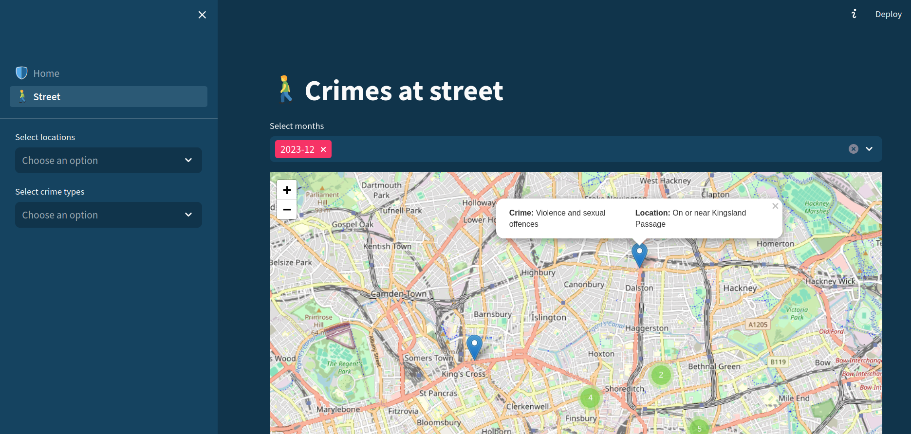
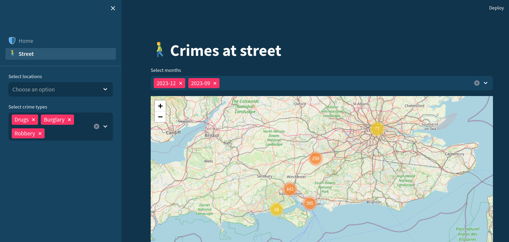

This project aims to assist those who plan to visit London or those who live in London. With this app, you can walk in the least risky areas to ensure your safety, avoiding places with higher security risks.

The data has been extracted from [https://data.police.uk/about](https://data.police.uk/data/archive/latest.zip), so they are real data.

 "Street Map")
 "Street Map")

